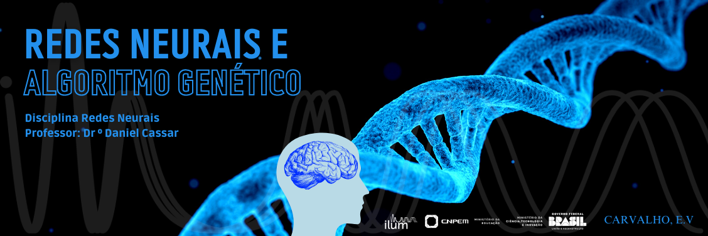

# 🧬🧠 **Disciplina de Redes Neurais e Algoritmos Genéticos** 🧬🧠

Fala, Colegas! Aqui você vai encontrar todas as práticas feitas na disciplina de Redes Neurais e Algoritmos Genéticos ministradas pelo querido professor Daniel Cassar na ILUM- Escola de Ciência.

## Sobre os dois primeiros experimentos:

Na primeira aula fomos introduzidos ao estudo de Algoritmos Genéticos e testamos dois experimentos: `Busca Aleatória e Busca em Grade`.
Na segunda aula discutimos a implementação dos `Algoritmos genéticos` em populações. Esse algortimo foi inspirado na teoria da evolução de Darwin e na área da computação utilzamos para solucnionar problemas de otimização.

Para saber mais clique em Algoritmos Genéticos e leia o README para encontrar sobre os dois primeiros experimentos que fizemos.

## Sobre a disciplina e os outros experimentos que você econtrará por aqui: 🔎

